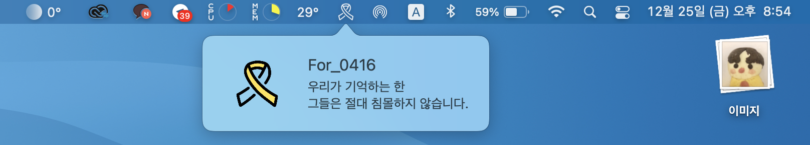
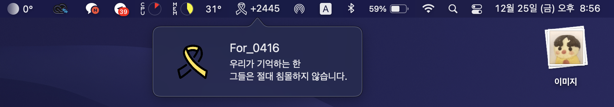

# For_0416

> 우리가 기억하는 한 \
그들은 절대 침몰하지 않습니다.

  
‘For_0416’은 맥의 메뉴 바에 세월호 노란리본 아이콘을 표시하는 앱입니다.   

당신의 노트북에 노란리본이 달려 \
이를 하루에 한 번이라도 보게 된다면,\
우리는 절대로 그들을 잊지 않을 것입니다.\
__그리고 그들은 절대 침몰하지 않을 것입니다.__
#

### 프리뷰

위 사진처럼 앱을 실행하면 맥 상단 메뉴 바에 \
노란리본 아이콘이 표시됩니다.

 

로고 버전 (logo version)
 

타이틀 버전 (title version)
 

날짜 표시 버전 (date version) \
*현제 날짜 표시는 앱을 실행해야만 동기화가 됩니다. 최대한 빨리 수정하겠습니다.
 

다크 모드
 

#

## 설치 방법

- [다운로드 링크](https://github.com/min-uuu/For_0416/releases/tag/v3.2)를 클릭하여 다운로드 페이지로 이동하여 지시사항을 따릅니다.

### 방법 안내
1. 위의 링크로 이동합니다.
2. 원하시는 버전의 압출파일을 다운받습니다.
3. 다운로드한 파일을 압축을 풉니다.
4. 파일에 들어있는 For_0416.app을 파인더 왼쪽 사이드바의 '응용 프로그램 '폴더에 넣어버립니다.
5. 조금 뒤 런치패드에 앱이 생깁니다.
6. 앱을 실행하시면 조금 뒤 메뉴바에 표시가 됩니다.

### 시작 프로그램 설정 방법
맥의 전원을 끈 후 다시 켜질 경우에 앱이 실행될 수 있도록 설정할 수 있습니다.
1. 시스템 환경설정 -> 사용자 및 그룹 -> 로그인 항목 탭에 들어갑니다.
2. '+' 버튼을 누르고 '응용 프로그램' 폴더에서 'For_0416'을 찾아 추가합니다.
#

### 버전 기록
v3.0 
- 디데이 기능 추가
- 버전 분리
- 팝 오버 ui 변경

v3.1
- 디데이 자동 갱신 기능 추가 시도 (현재 자동 갱신 X)

v3.2
- 로고 아이콘을 변경

### 해야할 일
1. 2014년 4월 16일부터 오늘까지의 날짜 표시 추가 - 완료 ([donghoony1](https://github.com/donghoony1)님의 도움)
1. 날짜 자동 갱신
1. 코드 수정
1. 디자인 리뉴얼
1. 기타 추가 기능 추가

#

### 참조
raywenderlich.com의 'Menus and Popovers in Menu Bar Apps for macOS'를 참고함
  [링크](https://www.raywenderlich.com/450-menus-and-popovers-in-menu-bar-apps-for-macos)
