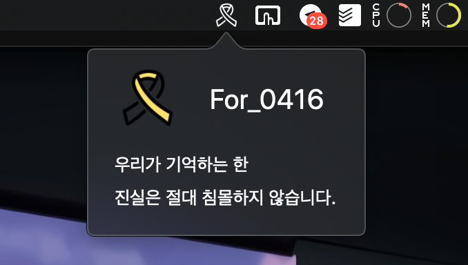

# For_0416

> 우리가 기억하는 한 
진실은 절대 침몰하지 않습니다.

 
‘For_0416’은 맥의 메뉴 바에 세월호 노란리본 아이콘을 표시하는 앱입니다.

#

당신의 맥에 노란리본이 달려 \
이를 하루에 한 번이라도 보게 된다면,\
우리는 절대로 그들을 잊지 않을 것입니다.

 

__어둠은 빛을 이길 수 없고,__\
__거짓은 참을 이길 수 없습니다.__

__진실은 절대 침몰하지 않을 것이고,__\
__우리는 결코 포기하지 않을 것입니다.__
 

#

### 프리뷰

위 사진의 가장 왼쪽처럼 앱을 실행하면 맥 상단 메뉴 바에 노란리본 아이콘이 표시됩니다.

 

라이트 모드
 

다크 모드
 

#

### 설치 방법

1. 오른쪽의 Releases 세선에서 가장 최신 버전을 클릭합니다.
2. 하단의 Assets 세션에서 dmg 파일을 눌러 다운로드 합니다.
3. 다운로드를 받고 dmg 파일을 열어 확인합니다.
4. 로고가 있는 For_0416 파일을 파인더에 응용 프로그램에 드래그하여 붙여넣기 합니다.
5. 앱 화면에 추가되어있는 For_0416 앱을 더블 클릭하여 실행합니다.
6. 실행이 종료되어도 다시 앱을 실행하면 작동합니다.

#

### 해야할 일
1. 2014년 4월 16일부터 오늘까지의 날짜 표시 추가
2. 코드 수정
3. 디자인 수정

#

### 참조
raywenderlich.com
  [링크](https://www.raywenderlich.com/450-menus-and-popovers-in-menu-bar-apps-for-macos)

