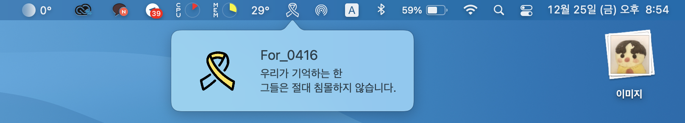
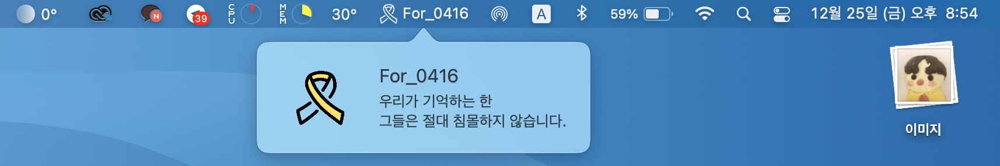
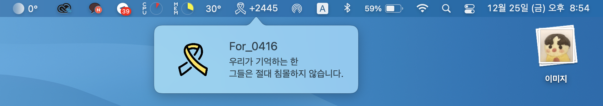
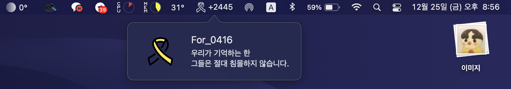

# For_0416

> 우리가 기억하는 한 \
그들은 절대 침몰하지 않습니다.

 
‘For_0416’은 맥의 메뉴 바에 세월호 노란리본 아이콘을 표시하는 앱입니다.

#

당신의 맥에 노란리본이 달려 \
이를 하루에 한 번이라도 보게 된다면,\
우리는 절대로 그들을 잊지 않을 것입니다.\
__그리고 그들은 절대 침몰하지 않을 것입니다.__

#

### 프리뷰

위 사진처럼 앱을 실행하면 맥 상단 메뉴 바에 \
노란리본 아이콘이 표시됩니다.

 

로고 버전 (logo version)
 

타이틀 버전 (title version)
 

날짜 표시 버전 (date version)
 

다크 모드
 

#

### 설치 방법

- [다운로드 링크](https://github.com/min-uuu/For_0416/releases/tag/v3.0)를 클릭하여 다운로드 페이지로 이동하여 지시사항을 따릅니다.

#

### 해야할 일
1. 2014년 4월 16일부터 오늘까지의 날짜 표시 추가 - 완료 (@donghoony1의 도움)
2. 코드 수정 - 완료 (2020.12)
3. 디자인 수정 - 완료 (2020.12)

#

### 참조
raywenderlich.com의 'Menus and Popovers in Menu Bar Apps for macOS'를 참고함
  [링크](https://www.raywenderlich.com/450-menus-and-popovers-in-menu-bar-apps-for-macos)

